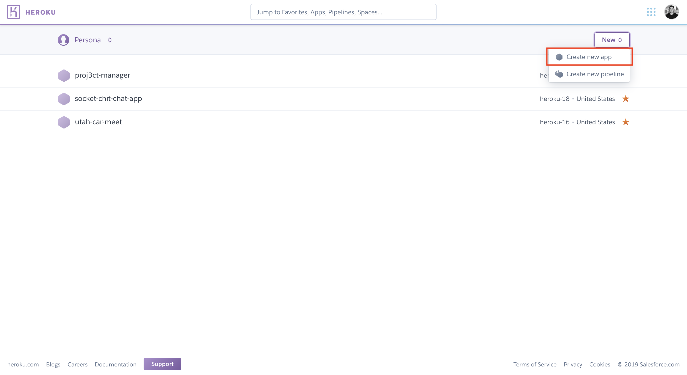
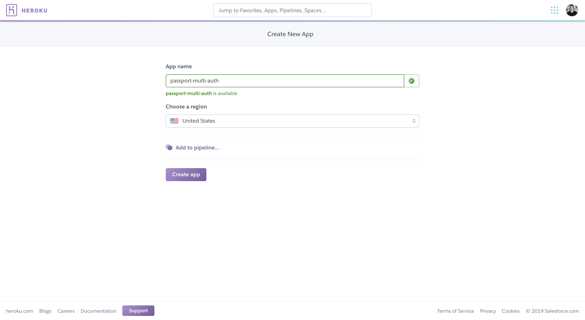
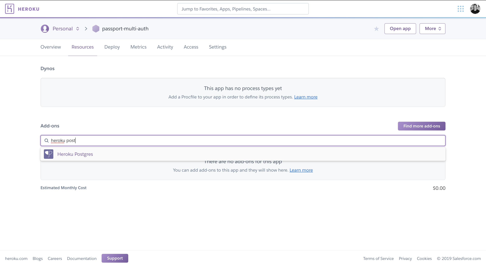
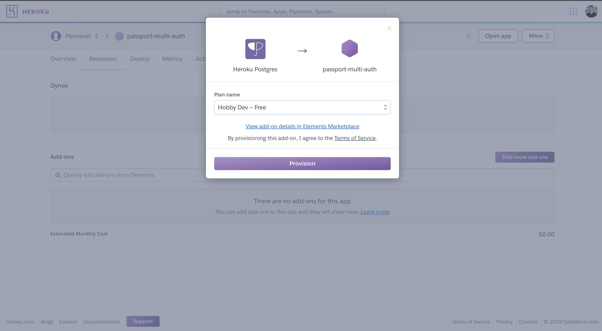
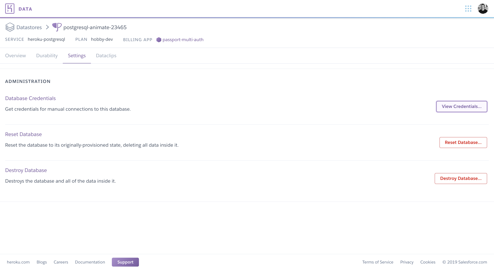
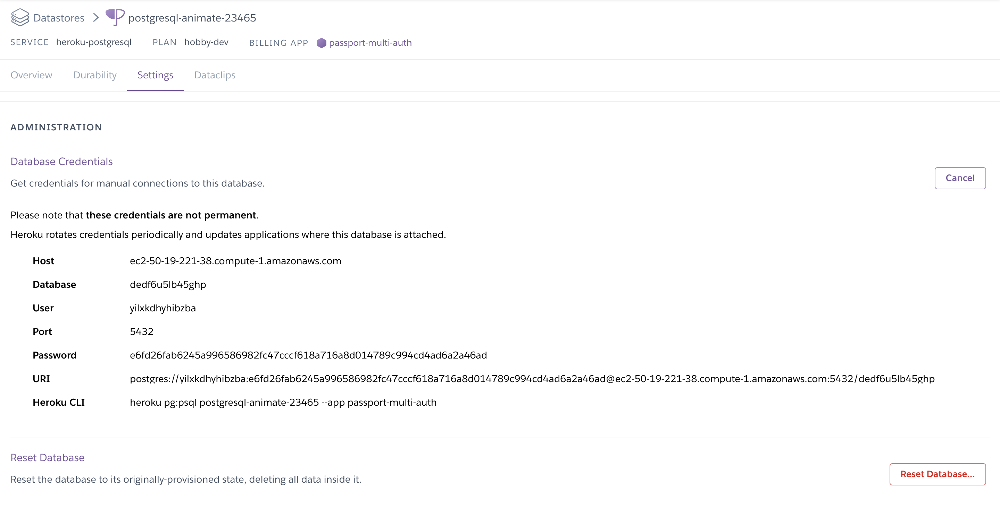

# React Node PostgreSQL Passport Multi Auth Examples
This repo was made to show example of using PassportJS in a Node server to setup authentication using multiple platforms. Local auth, which uses an email and password that the user provides. Gmail, where a user can use their Gmail account to authenticate. Twitter, where a user will use their twitter credentials to authenticate. Github, where a user uses their Github account to authenticate. Facebook, where a user uses their Facebook credentials.

## Setup

### Client
We first need to create our appplication, we will make a CRA. In your terminal run:
```bash
create-react-app 'name of your app'
```

### Database
The first thing we need to do is setup a cloud-based PostgreSQL database using Heroku.

Visit: [Heroku](https://dashboard.heroku.com/apps "Heroku App Dashboard")

In the top right, select the *New* dropdown menu and select the first option *Create new app*.



Then fill in the name for your new Heroku application.



After creating your new app, select the resources tab in the top left then search for the *Heroku Postgres* add-on.



Select the *Hobby Dev - Free* provision.


After adding *Heroku Postgres* select it under the add-ons section. This should open a new tab that will take you to the home dashboard for the new database. After routing to the new dashboard page, select the *Settings* tab in the top left. Once there, select the *View Credentials* button on the right. This will take us to a page to find our connection string.



Once there, copy the URI connection string



Now open up SQLtabs and we will create our database schema here.

Paste the URI connection string that we copied from Heroku into the top of SQLtabs. Make sure that you add the query *?ssl=true* to the end of the connection string to allow access to talk to this database.

We will now create a basic *Users* table that we will use to store the users that we will authenticate.
```sql
CREATE TABLE Users (
    id SERIAL PRIMARY KEY,
    username TEXT,
    password TEXT
);
```

### Server
Create a basic Node and Express Server.

```javascript
// Packages
const express = require('express');

// App Setup
const app = express();

// Middleware
app.use(express.json());

// Server Listening
app.listen(3005, () => console.log('Server Running'));
```

Let's get our client and server talking to each other by defining a proxy. In your package.json, add:

```json
"main": "server/index.js",
"proxy": "http://localhost:3005",
```

Proxy will tell the client how to talk to the server and main will tell nodemon what file to run for our server.

## Passport
We will be using a couple of different strategies to authenticate a user using Passport. First let's get passport configured in our server.

First we need to require passport into our server
```javascript
const express = require('express');
```

Then we need to initialize passport using the middlware passport provides.
```javascript
app.use(passport.initialize());
```

Then we will need to setup our serialization and deserialization so our user will be remembered on each sub request after authentication.
```javascript
passport.serializeUser(function (user, done) {
    done(null, user.id);
});

passport.deserializeUser(function (id, done) {
    done(null, id);
});
```

Passport should now be setup and good to go. The next thing that we will need is to create the actual strategies that will be used on the authentication requests.

### Strategies
Strategies are what is used in Passport to setup specific ways to authenticate a user into your application.